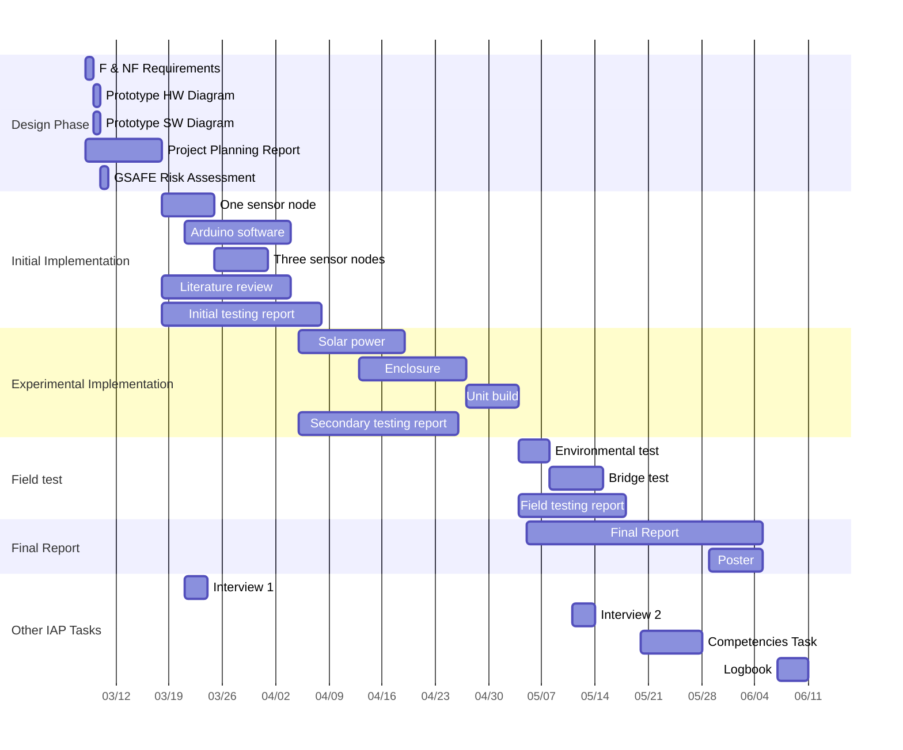

```mermaid
gantt
	axisFormat %m/%d
	Section Design Phase
		F & NF Requirements : 2023-3-8, 1d
		Prototype HW Diagram : 2023-3-9, 1d
		Prototype SW Diagram : 2023-3-9, 1d
		Project Planning Report: 2023-3-8, 10d
		GSAFE Risk Assessment: 2023-3-10, 1d
	Section Initial Implementation
		One sensor node : 2023-3-18, 7d
		Arduino software : 2023-3-21, 14d
		Three sensor nodes : 2023-3-25, 7d
		Literature review : 2023-3-18, 17d
		Initial testing report : 2023-3-18, 21d
	Section Experimental Implementation
		Solar power : 2023-4-5, 14d
		Enclosure : 2023-4-13, 14d
		Unit build : 2023-4-27, 7d
		Secondary testing report : 2023-4-5, 21d
	Section Field test
		Environmental test : 2023-5-4, 4d
		Bridge test : 2023-5-8, 7d
		Field testing report : 2023-5-4, 14d
	Section Final Report
		Final Report : 2023-5-5, 31d
		Poster : 2023-5-29, 7d
	Section Other IAP Tasks
		Interview 1 : 2023-3-21, 3d
		Interview 2 : 2023-5-11, 3d
		Competencies Task : 2023-5-20, 8d
		Logbook : 2023-6-7, 4d
```