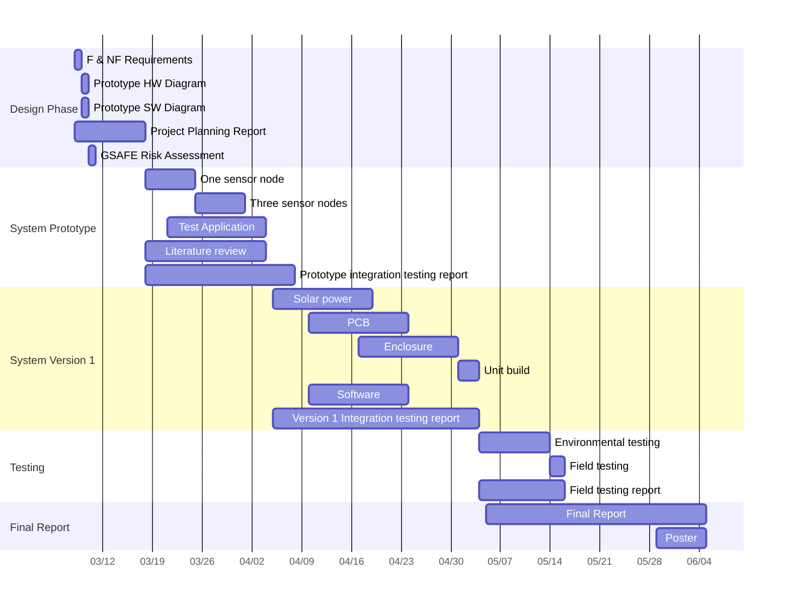

```mermaid
gantt
	axisFormat %m/%d
	Section Design Phase
		F & NF Requirements : 2023-3-8, 1d
		Prototype HW Diagram : 2023-3-9, 1d
		Prototype SW Diagram : 2023-3-9, 1d
		Project Planning Report: 2023-3-8, 10d
		GSAFE Risk Assessment: 2023-3-10, 1d
	Section System Prototype
		One sensor node : 2023-3-18, 7d
		Three sensor nodes : 2023-3-25, 7d
		Test Application : 2023-3-21, 14d
		Literature review : 2023-3-18, 17d
		Prototype integration testing report : 2023-3-18, 21d
	Section System Version 1
		Solar power : 2023-4-5, 14d
		PCB : 2023-4-10, 14d
		Enclosure : 2023-4-17, 14d
		Unit build : 2023-5-1, 3d
		Software : 2023-4-10, 14d
		Version 1 Integration testing report : 2023-4-5, 29d
	Section Testing
		Environmental testing : 2023-5-4, 10d
		Field testing : 2023-5-14, 2d
		Field testing report : 2023-5-4, 12d
	Section Final Report
		Final Report : 2023-5-5, 31d
		Poster : 2023-5-29, 7d
```